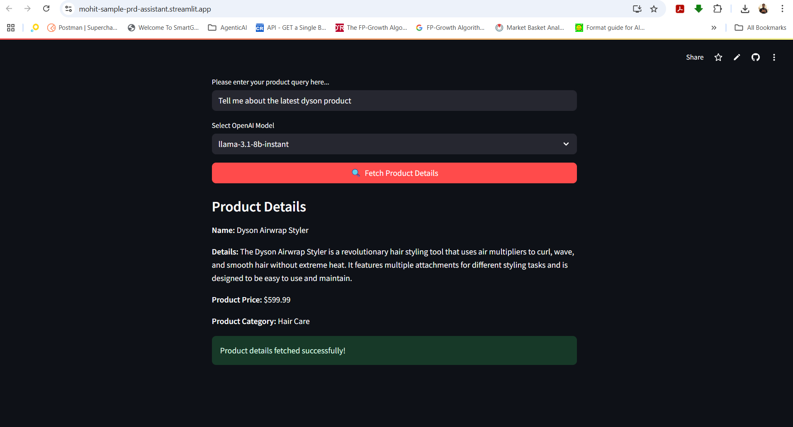

# 🛍️ Product-Assistant

Product-Assistant is an AI-powered tool that provides detailed information about products based on user queries. It leverages advanced language models via the Groq API and offers a user-friendly interface built with Streamlit.

## 🚀 Features

- Accepts natural language product queries from users.
- Returns structured product details: name, description, price, and category.
- Supports multiple language models (e.g., gemma2-9b-it, llama-3.1-8b-instant).
- Ensures output is well-formatted and easy to read.
- Prevents numeric-only queries for better accuracy.

## 🧱 Tech Stack

- Streamlit – frontend UI
- GROQ - Lnaguage Model
- Pydantic – data validation
- Python 3.9+ – core language

## 📦 Usage

1. **Install dependencies:**

    pip install -r requirements.txt

2. **Set up your environment:**
- Add your Groq API key to the `.env` file:
  ```
  GROQ_API_KEY="your_groq_api_key_here"
  ```

3. **Run the application:**

streamlit run productAssistant.py

4. **Interact with the assistant:**
- Enter your product query in the input box.
- Select a model from the dropdown.
- Click "Fetch Product Details" to get structured product information.

## Example Query

> "Tell me about the Apple iPhone 15 Pro."

**Output:**
- Name: Apple iPhone 15 Pro
- Details: [Description]
- Product Price: $[Price]
- Product Category: [Category]

## Requirements

See [requirements.txt](requirements.txt) for the full list.

## App Link
[Product Assistant](https://mohit-sample-prd-assistant.streamlit.app/)

## Screenshot


## License

MIT License
